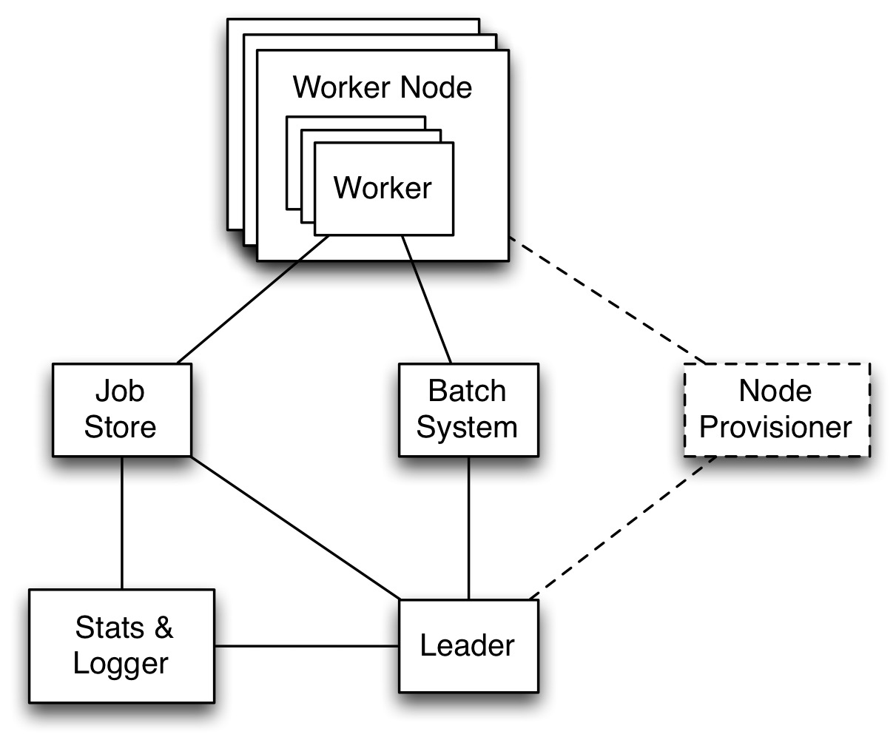

Toil Architecture
*****************

The following diagram layouts out the software architecture of Toil. 

    Figure 1: The basic components of the toil architecture. Note the node provisioning 
    is coming soon.

These components are described below: 
    * the leader:
        The leader is responsible for deciding which jobs should be run. To do this 
        it traverses the job graph. Currently this is a single threaded process, 
        but we make aggressive steps to prevent it becoming a bottleneck
        (see `Read-only Leader`_ described below).
    * the job-store:
        Handles all files shared between the components. Files in the job-store are the means
        by which the state of the workflow is maintained. Each job is backed by a file
        in the job store, and atomic updates to this state are used to ensure the workflow
        can always be resumed upon failure. The job-store can also store all user
        files, allowing them to be shared between jobs. The job-store is defined by the abstract
        class :class:`toil.jobStores.AbstractJobStore`. Multiple implementations of this
        class allow Toil to support different back-end file stores, e.g.: S3, network file systems,
        Azure file store, etc.
    * workers:
        The workers are temporary processes responsible for running jobs, 
        one at a time per worker. Each worker process is invoked with a job argument
        that it is responsible for running. The worker monitors this job and reports
        back success or failure to the leader by editing the job's state in the file-store. 
        If the job defines successor jobs the worker may choose to immediately run them
        (see `Job Chaining`_ below).
    * the batch-system: 
        Responsible for scheduling the jobs given to it by the leader, creating a 
        worker command for each job. The batch-system is defined by the abstract class
        class :class:`toil.batchSystems.AbstractBatchSystem`. Toil uses multiple existing
        batch systems to schedule jobs, including Apache Mesos, GridEngine and a multi-process
        single node implementation that allows workflows to be run without any of these frameworks.
        Toil can therefore fairly easily be made to run a workflow using an existing cluster.
    * the node provisioner:
        Creates worker nodes in which the batch system schedules workers. This is currently
        being developed. It is defined by the abstract class :class:`toil.provisioners.AbstractProvisioner`.
    * the statistics and logging monitor: 
        Monitors logging and statistics produced by the workers and reports them. Uses the 
        job-store to gather this information.

Optimizations
-------------

Toil implements lots of optimizations designed to allow it to scale out. 
Many are not worth mentioning, but we detail some of the key ones below that we
have found useful.

Read-only Leader
~~~~~~~~~~~~~~~~

The leader process is currently implemented as a single thread. Most of the leader's
tasks revolve around processing the state of jobs, each stored as a file within the job-store.
To minimise the load on this thread, each worker does as much work as possible 
to manage the state of the job it is running. As a result, with a couple of minor exceptions, 
the leader process never needs to write or update the state of a job within the job-store. 
For example, when a job is complete and has no further successors the responsible 
worker deletes the job from the job-store, marking it complete. The leader then 
only has to check for the existence of the file when it receives a signal from the batch-system
to know that the job is complete. This off-loading of state management is orthogonal to
future parallelization of the leader. 

Job Chaining
~~~~~~~~~~~~

The scheduling of successor jobs is partially managed by the worker, reducing the 
number of individual jobs the leader needs to process. Currently this is very 
simple: if the there is a single next successor job to run and it's resources fit within the
resources of the current job and closely match the resources of the current job then  
the job is run immediately on the worker without returning to the leader. Further extensions
of this strategy are possible, but for many workflows which define a series of serial successors
(e.g. map sequencing reads, post-process mapped reads, etc.) this pattern is very effective
at reducing leader workload. 

Preemptable Node Support
~~~~~~~~~~~~~~~~~~~~~~~~

Critical to running at large-scale is dealing with intermittent node failures. Toil is
therefore designed to always be resumable providing the job-store does not become corrupt. 
This robustness allows Toil to run on preemptible nodes, which are only available when others are not 
willing to pay more to use them. Designing workflows that divide into many short individual jobs 
that can use preemptable nodes allows for workflows to be efficiently scheduled and executed.  

Caching
~~~~~~~

ARJUN - please write something useful here.

