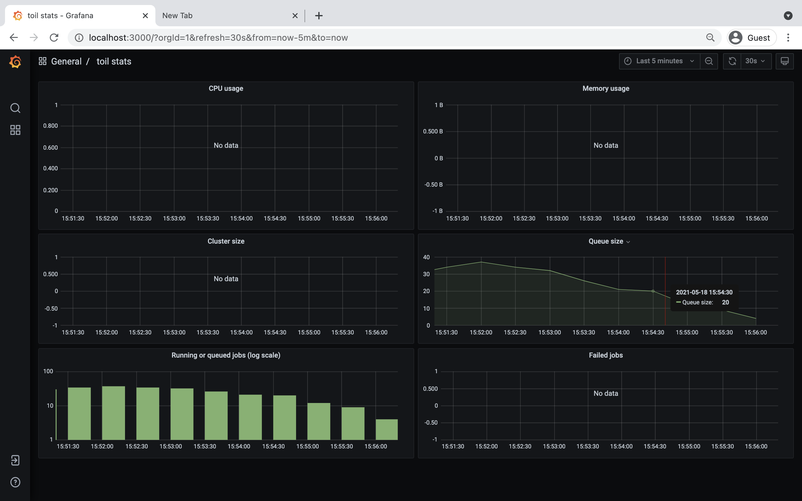

.. _runningAWS:

Running in AWS
==============

Toil jobs can be run on a variety of cloud platforms. Of these, Amazon Web
Services (AWS) is currently the best-supported solution. Toil provides the
:ref:`clusterRef` to conveniently create AWS clusters, connect to the leader
of the cluster, and then launch a workflow. The leader handles distributing
the jobs over the worker nodes and autoscaling to optimize costs.

The :ref:`Autoscaling` section details how to create a cluster and run a workflow
that will dynamically scale depending on the workflow's needs.

The :ref:`StaticProvisioning` section explains how a static cluster (one that
won't automatically change in size) can be created and provisioned (grown, shrunk, destroyed, etc.).

.. _EC2 instance type: https://aws.amazon.com/ec2/instance-types/

.. _prepareAWS:

Preparing your AWS environment
------------------------------

To use Amazon Web Services (AWS) to run Toil or to just use S3 to host the files
during the computation of a workflow, first set up and configure an account with AWS:

#. If necessary, create and activate an `AWS account`_

#. Next, generate a key pair for AWS with the command (do NOT generate your key pair with the Amazon browser): ::

    $ ssh-keygen -t rsa

#. This should prompt you to save your key.  Please save it in ::

    ~/.ssh/id_rsa

#. Now move this to where your OS can see it as an authorized key::

    $ cat ~/.ssh/id_rsa.pub >> ~/.ssh/authorized_keys

#. Next, you'll need to add your key to the `ssh-agent`::

    $ eval `ssh-agent -s`
    $ ssh-add

   If your key has a passphrase, you will be prompted to enter it here once.

#. You'll also need to chmod your private key (good practice but also enforced by AWS)::

    $ chmod 400 id_rsa

#. Now you'll need to add the key to AWS via the browser.  For example, on us-west1, this address would accessible at::

    https://us-west-1.console.aws.amazon.com/ec2/v2/home?region=us-west-1#KeyPairs:sort=keyName

#. Now click on the "Import Key Pair" button to add your key:

    .. image:: amazonaddkeypair.png
       :target: https://us-west-1.console.aws.amazon.com/ec2/v2/home?region=us-west-1#KeyPairs:sort=keyName
       :alt: Adding an Amazon Key Pair

#. Next, you need to create an AWS access key.  First go to the IAM dashboard, again; for "us-west1", the example link would be here::

    https://console.aws.amazon.com/iam/home?region=us-west-1#/home

#. The directions (transcribed from: https://docs.aws.amazon.com/general/latest/gr/managing-aws-access-keys.html ) are now:

    1. On the IAM Dashboard page, choose your account name in the navigation bar, and then choose My Security Credentials.
    2. Expand the Access keys (access key ID and secret access key) section.
    3. Choose Create New Access Key. Then choose Download Key File to save the access key ID and secret access key to a file on your computer. After you close the dialog box, you can't retrieve this secret access key again.

#. Now you should have a newly generated "AWS Access Key ID" and "AWS Secret Access Key".  We can now install the AWS CLI and make sure that it has the proper credentials: ::

    $ pip install awscli --upgrade --user

#. Now configure your AWS credentials with: ::

    $ aws configure

#. Add your "AWS Access Key ID" and "AWS Secret Access Key" from earlier and your region and output format: ::

    " AWS Access Key ID [****************Q65Q]: "
    " AWS Secret Access Key [****************G0ys]: "
    " Default region name [us-west-1]: "
    " Default output format [json]: "

   This will create the files `~/.aws/config` and `~/.aws/credentials`.

#. If not done already, install toil (example uses version 5.3.0, but we recommend the latest release): ::

    $ virtualenv venv
    $ source venv/bin/activate
    $ pip install toil[all]==5.3.0

#. Now that toil is installed and you are running a virtualenv, an example of launching a toil leader node would be the following
   (again, note that we set TOIL_APPLIANCE_SELF to toil version 5.3.0 in this example, but please set the version to
   the installed version that you are using if you're using a different version): ::

    $ TOIL_APPLIANCE_SELF=quay.io/ucsc_cgl/toil:5.3.0 \
          toil launch-cluster clustername \
          --leaderNodeType t2.medium \
          --zone us-west-1a \
          --keyPairName id_rsa

To further break down each of these commands:

    **TOIL_APPLIANCE_SELF=quay.io/ucsc_cgl/toil:latest** --- This is optional.  It specifies a mesos docker image that we maintain with the latest version of toil installed on it.  If you want to use a different version of toil, please specify the image tag you need from https://quay.io/repository/ucsc_cgl/toil?tag=latest&tab=tags.

    **toil launch-cluster** --- Base command in toil to launch a cluster.

    **clustername** --- Just choose a name for your cluster.

    **--leaderNodeType t2.medium** --- Specify the leader node type.  Make a t2.medium (2CPU; 4Gb RAM; $0.0464/Hour).  List of available AWS instances: https://aws.amazon.com/ec2/pricing/on-demand/

    **--zone us-west-1a** --- Specify the AWS zone you want to launch the instance in.  Must have the same prefix as the zone in your awscli credentials (which, in the example of this tutorial is: "us-west-1").

    **--keyPairName id_rsa** --- The name of your key pair, which should be "id_rsa" if you've followed this tutorial.

.. _AWS account: https://aws.amazon.com/premiumsupport/knowledge-center/create-and-activate-aws-account/
.. _key pair: http://docs.aws.amazon.com/AWSEC2/latest/UserGuide/ec2-key-pairs.html
.. _Amazon's instructions : http://docs.aws.amazon.com/AWSEC2/latest/UserGuide/ec2-key-pairs.html#how-to-generate-your-own-key-and-import-it-to-aws
.. _install: http://docs.aws.amazon.com/cli/latest/userguide/installing.html
.. _configure: http://docs.aws.amazon.com/cli/latest/userguide/cli-chap-getting-started.html
.. _blog instructions: https://toilpipelines.wordpress.com/2018/01/18/running-toil-autoscaling-with-aws/

.. _awsJobStore:

AWS Job Store
-------------

Using the AWS job store is straightforward after you've finished :ref:`prepareAWS`;
all you need to do is specify the prefix for the job store name.

To run the sort example :ref:`sort example <sortExample>` with the AWS job store you would type ::

    $ python sort.py aws:us-west-2:my-aws-sort-jobstore

.. _installProvisioner:

Toil Provisioner
----------------

The Toil provisioner is included in Toil alongside the ``[aws]`` extra and
allows us to spin up a cluster.

Getting started with the provisioner is simple:

#. Make sure you have Toil installed with the AWS extras. For detailed instructions see :ref:`extras`.

#. You will need an AWS account and you will need to save your AWS credentials on your local
   machine. For help setting up an AWS account see
   `here <http://docs.aws.amazon.com/cli/latest/userguide/cli-chap-getting-set-up.html>`__. For
   setting up your AWS credentials follow instructions
   `here <http://docs.aws.amazon.com/cli/latest/userguide/cli-chap-getting-started.html#cli-config-files>`__.

The Toil provisioner is built around the Toil Appliance, a Docker image that bundles
Toil and all its requirements (e.g. Mesos). This makes deployment simple across
platforms, and you can even simulate a cluster locally (see :ref:`appliance_dev` for details).

.. admonition:: Choosing Toil Appliance Image

    When using the Toil provisioner, the appliance image will be automatically chosen
    based on the pip-installed version of Toil on your system. That choice can be
    overridden by setting the environment variables ``TOIL_DOCKER_REGISTRY`` and ``TOIL_DOCKER_NAME`` or
    ``TOIL_APPLIANCE_SELF``. See :ref:`envars` for more information on these variables. If
    you are developing with autoscaling and want to test and build your own
    appliance have a look at :ref:`appliance_dev`.

For information on using the Toil Provisioner have a look at :ref:`Autoscaling`.

.. _launchAwsClusterDetails:

Details about Launching a Cluster in AWS
----------------------------------------

Using the provisioner to launch a Toil leader instance is simple using the ``launch-cluster`` command. For example,
to launch a cluster named "my-cluster" with a t2.medium leader in the us-west-2a zone, run ::

    (venv) $ toil launch-cluster my-cluster \
                 --leaderNodeType t2.medium \
                 --zone us-west-2a \
                 --keyPairName <your-AWS-key-pair-name>

The cluster name is used to uniquely identify your cluster and will be used to
populate the instance's ``Name`` tag. Also, the Toil provisioner will
automatically tag your cluster with an ``Owner`` tag that corresponds to your
keypair name to facilitate cost tracking. In addition, the ``ToilNodeType`` tag
can be used to filter "leader" vs. "worker" nodes in your cluster.

The leaderNodeType is an `EC2 instance type`_. This only affects the leader node.

.. _EC2 instance type: https://aws.amazon.com/ec2/instance-types/

The ``--zone`` parameter specifies which EC2 availability zone to launch the cluster in.
Alternatively, you can specify this option via the ``TOIL_AWS_ZONE`` environment variable.
Note: the zone is different from an EC2 region. A region corresponds to a geographical area
like ``us-west-2 (Oregon)``, and availability zones are partitions of this area like
``us-west-2a``.

By default, Toil creates an IAM role for each cluster with sufficient permissions
to perform cluster operations (e.g. full S3, EC2, and SDB access). If the default permissions
are not sufficient for your use case (e.g. if you need access to ECR), you may create a
custom IAM role with all necessary permissions and set the ``--awsEc2ProfileArn`` parameter
when launching the cluster. Note that your custom role must at least have
:ref:`these permissions <minAwsPermissions>` in order for the Toil cluster to function properly.

In addition, Toil creates a new security group with the same name as the cluster name with
default rules (e.g. opens port 22 for SSH access). If you require additional security groups,
you may use the ``--awsEc2ExtraSecurityGroupId`` parameter when launching the cluster.
**Note:** Do not use the same name as the cluster name for the extra security groups as
any security group matching the cluster name will be deleted once the cluster is destroyed.

For more information on options try: ::

    (venv) $ toil launch-cluster --help

.. _StaticProvisioning:

Static Provisioning
^^^^^^^^^^^^^^^^^^^
Toil can be used to manage a cluster in the cloud by using the :ref:`clusterRef`.
The cluster utilities also make it easy to run a toil workflow directly on this
cluster. We call this static provisioning because the size of the cluster does not
change. This is in contrast with :ref:`Autoscaling`.

To launch worker nodes alongside the leader we use the ``-w`` option::

    (venv) $ toil launch-cluster my-cluster \
                 --leaderNodeType t2.small -z us-west-2a \
                 --keyPairName your-AWS-key-pair-name \
                 --nodeTypes m3.large,t2.micro -w 1,4

This will spin up a leader node of type t2.small with five additional workers --- one m3.large instance and four t2.micro.

Currently static provisioning is only possible during the cluster's creation.
The ability to add new nodes and remove existing nodes via the native provisioner is
in development. Of course the cluster can always be deleted with the
:ref:`destroyCluster` utility.

Uploading Workflows
^^^^^^^^^^^^^^^^^^^

Now that our cluster is launched, we use the :ref:`rsyncCluster` utility to copy
the workflow to the leader. For a simple workflow in a single file this might
look like ::

    (venv) $ toil rsync-cluster -z us-west-2a my-cluster toil-workflow.py :/

.. note::

    If your toil workflow has dependencies have a look at the :ref:`autoDeploying`
    section for a detailed explanation on how to include them.

.. _Autoscaling:

Running a Workflow with Autoscaling
^^^^^^^^^^^^^^^^^^^^^^^^^^^^^^^^^^^

Autoscaling is a feature of running Toil in a cloud whereby additional cloud instances are launched to run the workflow.
Autoscaling leverages Mesos containers to provide an execution environment for these workflows.

.. note::

   Make sure you've done the AWS setup in :ref:`prepareAWS`.

#. Download :download:`sort.py <../../../src/toil/test/sort/sort.py>`

#. Launch the leader node in AWS using the :ref:`launchCluster` command: ::

    (venv) $ toil launch-cluster <cluster-name> \
                 --keyPairName <AWS-key-pair-name> \
                 --leaderNodeType t2.medium \
                 --zone us-west-2a

#. Copy the ``sort.py`` script up to the leader node: ::

    (venv) $ toil rsync-cluster -z us-west-2a <cluster-name> sort.py :/root

#. Login to the leader node: ::

    (venv) $ toil ssh-cluster -z us-west-2a <cluster-name>

#. Run the script as an autoscaling workflow: ::

    $ python /root/sort.py aws:us-west-2:<my-jobstore-name> \
          --provisioner aws \
          --nodeTypes c3.large \
          --maxNodes 2 \
          --batchSystem mesos

.. note::

    In this example, the autoscaling Toil code creates up to two instances of type `c3.large` and launches Mesos
    slave containers inside them. The containers are then available to run jobs defined by the `sort.py` script.
    Toil also creates a bucket in S3 called `aws:us-west-2:autoscaling-sort-jobstore` to store intermediate job
    results. The Toil autoscaler can also provision multiple different node types, which is useful for workflows
    that have jobs with varying resource requirements. For example, one could execute the script with
    ``--nodeTypes c3.large,r3.xlarge --maxNodes 5,1``, which would allow the provisioner to create up to five
    c3.large nodes and one r3.xlarge node for memory-intensive jobs. In this situation, the autoscaler would avoid
    creating the more expensive r3.xlarge node until needed, running most jobs on the c3.large nodes.

#. View the generated file to sort::

    $ head fileToSort.txt

#. View the sorted file::

    $ head sortedFile.txt

For more information on other autoscaling (and other) options have a look at :ref:`workflowOptions` and/or run ::

    $ python my-toil-script.py --help

.. important::

    Some important caveats about starting a toil run through an ssh session are
    explained in the :ref:`sshCluster` section.

Preemptability
^^^^^^^^^^^^^^

Toil can run on a heterogeneous cluster of both preemptable and non-preemptable nodes. Being preemptable node simply
means that the node may be shut down at any time, while jobs are running. These jobs can then be restarted later
somewhere else.

A node type can be specified as preemptable by adding a `spot bid`_ to its entry in the list of node types provided with
the ``--nodeTypes`` flag. If spot instance prices rise above your bid, the preemptable node whill be shut down.

While individual jobs can each explicitly specify whether or not they should be run on preemptable nodes
via the boolean ``preemptable`` resource requirement, the ``--defaultPreemptable`` flag will allow jobs without a
``preemptable`` requirement to run on preemptable machines.

.. admonition:: Specify Preemptability Carefully

    Ensure that your choices for ``--nodeTypes`` and ``--maxNodes <>`` make
    sense for your workflow and won't cause it to hang. You should make sure the
    provisioner is able to create nodes large enough to run the largest job
    in the workflow, and that non-preemptable node types are allowed if there are
    non-preemptable jobs in the workflow.

Finally, the ``--preemptableCompensation`` flag can be used to handle cases where preemptable nodes may not be
available but are required for your workflow. With this flag enabled, the autoscaler will attempt to compensate
for a shortage of preemptable nodes of a certain type by creating non-preemptable nodes of that type, if
non-preemptable nodes of that type were specified in ``--nodeTypes``.

.. _spot bid: https://aws.amazon.com/ec2/spot/pricing/

Using MinIO and S3-Compatible object stores
^^^^^^^^^^^^^^^^^^^^^^^^^^^^^^^^^^^^^^^^^^^

Toil can be configured to access files stored in an `S3-compatible object store`_ such as `MinIO`_. The following environment variables can be used to configure the S3 connection used:

- ``TOIL_S3_HOST``: the IP address or hostname to use for connecting to S3

- ``TOIL_S3_PORT``: the port number to use for connecting to S3, if needed

- ``TOIL_S3_USE_SSL``: enable or disable the usage of SSL for connecting to S3 (``True`` by default)

Examples::

    TOIL_S3_HOST=127.0.0.1
    TOIL_S3_PORT=9010
    TOIL_S3_USE_SSL=False

.. _S3-compatible object store: https://en.wikipedia.org/wiki/Amazon_S3#S3_API_and_competing_services
.. _MinIO: https://min.io/

Dashboard
---------

Toil provides a dashboard for viewing the RAM and CPU usage of each node, the number of
issued jobs of each type, the number of failed jobs, and the size of the jobs queue. To launch this dashboard
for a toil workflow, include the ``--metrics`` flag in the toil script command. The dashboard can then be viewed
in your browser at localhost:3000 while connected to the leader node through ``toil ssh-cluster``:

To change the default port number, you can use the ``--grafana_port`` argument: ::

    (venv) $ toil ssh-cluster -z us-west-2a --grafana_port 8000 <cluster-name>

On AWS, the dashboard keeps track of every node in the cluster to monitor CPU and RAM usage, but it
can also be used while running a workflow on a single machine. The dashboard uses Grafana as the
front end for displaying real-time plots, and Prometheus for tracking metrics exported by toil:

In order to use the dashboard for a non-released toil version, you will have to build the containers locally with
``make docker``, since the prometheus, grafana, and mtail containers used in the dashboard are tied to a specific toil
version.
